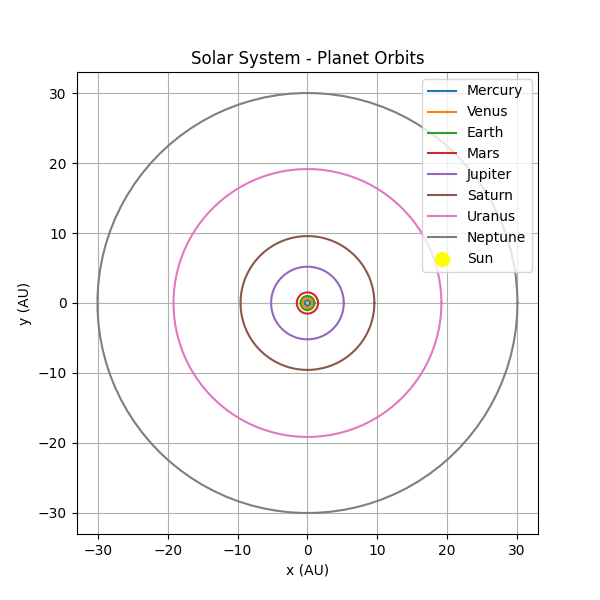

## Solar System - Planet Orbits

This project visualizes the orbits of the planets in our solar system using Python. The program uses the `matplotlib` library to plot the elliptical orbits of the planets around the Sun. The planetary distances are measured in Astronomical Units (AU), where 1 AU is the average distance between Earth and the Sun.

## Project Description

This Python script generates a plot of the solar system, displaying the orbits of the eight planets. Each planet's orbit is represented as a circle, with the distance from the Sun (in AU) specified for each planet. The Sun is positioned at the center of the plot.

The distances for each planet's orbit are as follows:
- Mercury: 0.39 AU
- Venus: 0.72 AU
- Earth: 1.0 AU
- Mars: 1.52 AU
- Jupiter: 5.2 AU
- Saturn: 9.58 AU
- Uranus: 19.18 AU
- Neptune: 30.07 AU

## Features

- Displays the orbits of all eight planets in the solar system.
- The Sun is shown at the center.
- The plot uses the `matplotlib` library for graphical visualization.
- The plot is drawn with equal aspect ratio to maintain the circular appearance of the orbits.

## Requirements

- Python
- `matplotlib` library
- `numpy` library

## Screenshot

© mdkhademali
